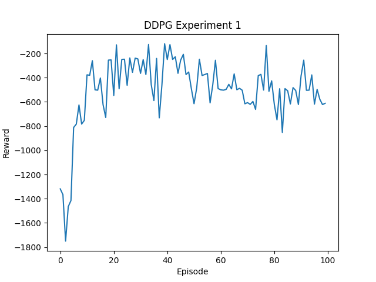

# DDPG_pytorch
---
This is a simple implement of [Deep Deterministic Policy Gradient](https://arxiv.org/abs/1509.02971)**（DDPG）** using PyTorch.

### To do list
---
* Seperating the training process from the testing process.
* Testing in other environments.

### How to run
---
* Clone repository :
```
$ git clone https://github.com/xiaopeng-whu/DDPG_pytorch.git 
$ cd DDPG_pytorch
```

* Training : results of one environment and its training curves:

	* Pendulum-v0
`
 $ python main.py -x 1
`



### References
---
[DDPG-implementation](https://github.com/LM095/DDPG-implementation)
